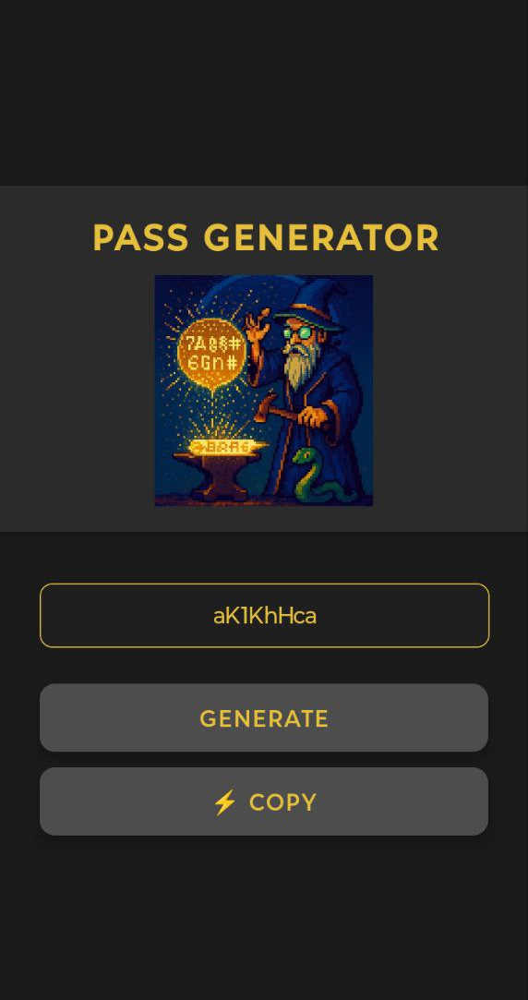

# 🔐 Password Generator App

Um **aplicativo mobile funcional** para gerar senhas seguras e copiar rapidamente para a área de transferência.
Desenvolvido em **React Native + Expo**, com foco em praticidade e interface limpa.

---

## **Funcionalidades**

* **Gerar Senhas Aleatórias**
  Gera senhas seguras com um único toque no botão **"GENERATE"**.

* **Copiar Senha com um Toque**
  Copie rapidamente a senha gerada para a área de transferência usando o botão **"COPY"**.

* **Interface Simples e Intuitiva**
  Interface minimalista com foco na experiência do usuário.

---

## **Screenshots**



Imagem gerada por IA


---

## **Tecnologias Utilizadas**

* **React Native (Expo)**
* **TypeScript**
* **Clipboard (expo-clipboard)**
* **Componentização e Estilização com `StyleSheet`**

---

## **Estrutura Principal**

```
src/
├── components/
│   ├── Button/
│   │   ├── Button.tsx
│   │   └── ButtonStyles.tsx
│   ├── Logo/
│   │   ├── Logo.tsx
│   │   └── LogoStyles.tsx
│   ├── Menu/
│   │   ├── Menu.tsx
│   │   └── MenuStyles.tsx
│   └── TextInput/
│       ├── TextInput.tsx
│       └── TextInputStyles.tsx
├── pages/Home
│   └── Home.tsx
│   └── Style.tsx
├── services/
│   └── passwordService.ts
└── Style.tsx
```

---

## **Como Executar Localmente**

### Pré-requisitos:

* [Node.js](https://nodejs.org/)
* [Expo CLI](https://expo.dev/)

### Rodando o app:

```bash
# Clone o repositório
git clone https://github.com/TheEddu/app-mobile-password-generator

# Acesse o diretório do projeto
cd app-mobile-password-generator

# Instale as dependências
npm install

# Inicie o projeto
npx expo start
```

---

## **Licença**

Este projeto é de uso livre para estudos e aprimoramento.
Licença **MIT**.
